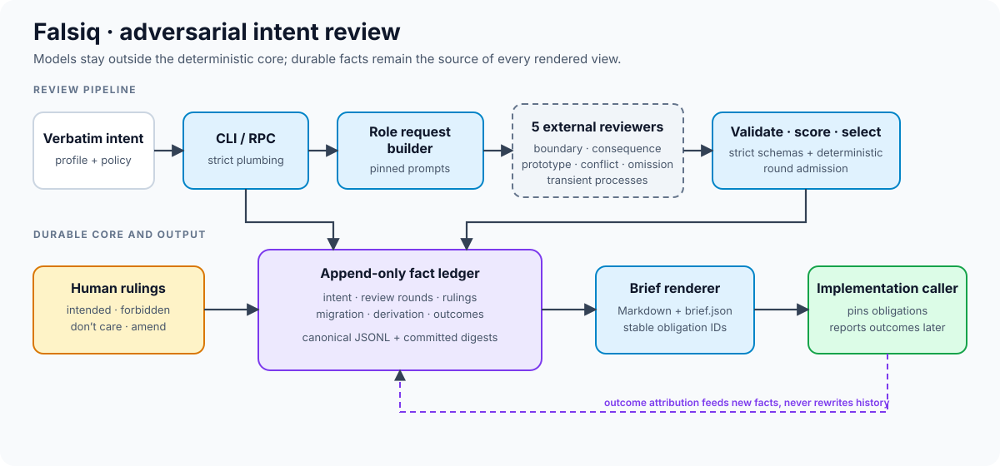
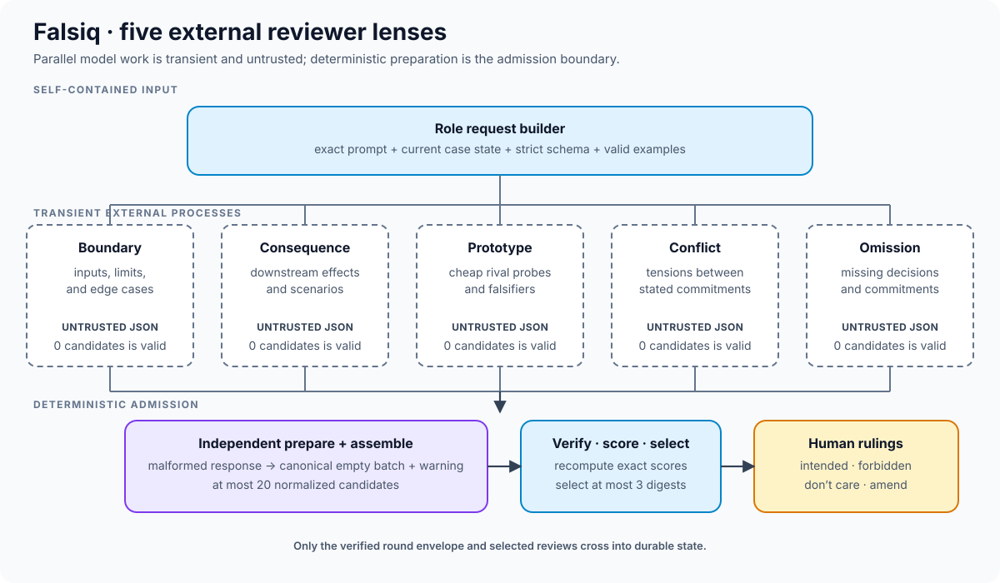

# Falsiq

Falsiq is a structured intent-review layer that can run before a coding agent
implements a change. It records the user's intent and rulings in an
append-only JSONL ledger, then derives disposable implementation briefs from
that durable record.

The Python CLI is deterministic and never invokes a language model. It packages
the canonical production prompts and emits self-contained agent requests; the
agent skill calls the CLI from outside the model boundary.

Version 1 adds a separately versioned machine contract, schema-v2 durable
provenance, stdio RPC, external state roots, domain profiles, and outcome
attribution. Existing schema-v1 ledger lines remain readable and are never
rewritten. See [`contract/README.md`](contract/README.md) for the only supported
cross-component boundary and [`state.md`](state.md) for implementation status.



## Development

```console
uv sync --locked
uv run --python 3.13 pytest
uv run ruff check .
```

Python 3.13 or newer is required.

## Version 1 quick start

Migration is append-only and dry-runs unless `--apply` is present:

```console
falsiq migrate --to 2
falsiq migrate --to 2 --apply
```

After migration, new cases pin a domain profile. Review append policy is loaded
from an optional TOML file; the default is `max_rounds = 2`.

```console
falsiq intent --profile writing "Draft a welcoming email"
falsiq review add --policy policy.toml -f selector-round.json
falsiq brief --case CASE_ID --json
falsiq outcomes report --json
```

Set `FALSIQ_STATE_ROOT` to an existing, non-symlink directory to operate without
a Git repository and keep durable Falsiq state outside a target workspace.
`falsiq rpc` serves one strict JSON request and response per line over stdio; it
does not invoke models, agents, sockets, or network services.

Architecture, integration, and operator procedures are documented in
[`docs/architecture.md`](docs/architecture.md),
[`docs/integration.md`](docs/integration.md), and
[`docs/operations.md`](docs/operations.md).

The command can be run from the checkout with `uv run falsiq` or installed as
the `falsiq` console script. The production skill always uses the installed
console script; it does not assume the target repository is a Python project.

## Agent skill

The canonical Falsiq skill is [`skill/SKILL.md`](skill/SKILL.md). Two
checked-in directory symlinks expose it to skill-aware agent hosts:
`.claude/skills/falsiq` for Claude Code 2.1.203 and newer, and
`.agents/skills/falsiq` for the cross-tool skills standard read by Cursor,
Codex, and other generic agents. Keeping discovery as symlinks makes the
workflow, helper scripts, and fixtures a single source of truth instead of
maintaining copies under each discovery root. The skill resolves its own
location as `${SKILL_DIR}` (equal to `${CLAUDE_SKILL_DIR}` under Claude Code),
so it works unchanged under any host.

Installing or discovering the skill does not activate it. A user must
explicitly invoke `/falsiq` or include the phrase `with falsiq` in the current
request. Repository configuration, including an existing `.falsiq/` directory,
never activates the workflow by itself. The exact standalone message
`skip falsiq` invokes only the bypass-recording path.

The Python wheel and the agent skill are intentionally separate deliverables.
The wheel installs the `falsiq` package, its canonical prompt assets, and console
scripts; it does not place files into a target repository. To use Falsiq
elsewhere, an operator installs the matching tool version outside the target
dependency graph and separately places the `skill/` directory under a discovery
root: `<target>/.agents/skills/falsiq/` for Cursor, Codex, and generic agents,
or `<target>/.claude/skills/falsiq/` for Claude Code. For example, from
outside the target repo:

```console
uv tool install /absolute/path/to/falsiq
mkdir -p /absolute/path/to/target/.agents/skills
cp -R /absolute/path/to/falsiq/skill /absolute/path/to/target/.agents/skills/falsiq
```

Production prompts exist only under `falsiq/prompts/`. The CLI places their exact
text, the Pydantic-generated response schema, and valid role-bound examples in
each agent request, so the copied skill needs no prompt mirror. The skill checks
for exactly `falsiq 0.1.0` and stops with an installation prerequisite instead
of modifying target dependencies. In its source checkout, the checked-in
symlinks remain the normal discovery paths; do not replace them with generated
second copies.

## End-to-end demos

Two short, standalone tutorials show the intent-to-guard workflow in disposable
Git repositories:

- [Precise intent with no selected reviews](docs/demos/no_review_handoff.md)
  demonstrates the valid empty-selection path through derivation and guard.
- [Collision resolved by an amendment](docs/demos/collision_amendment.md)
  demonstrates the human stop, replacement intent, second-round gate,
  derivation, and guard.

Each tutorial contains one self-contained command block and its stable expected
output. The test suite extracts and runs those exact blocks, so CLI changes
cannot silently leave the walkthroughs stale. The inline responses are an
offline teaching replay; production usage still requires fresh external
reviewers and a fresh external deriver as specified by the agent skill.

## Executable agents

Agent execution is a separate `falsiq-agent` program so the `falsiq` plumbing
CLI remains model-free. Each agent is a fresh process that receives exactly one
JSONL request on standard input and must emit exactly one JSONL response:

```json
{"role":"reviewer.boundary","request_id":"r1","payload":{"case_id":"c1"}}
{"request_id":"r1","response":{"reviews":[]}}
```

Replay is the normal mode. It requires the incoming request to match the whole
recorded request, then atomically captures a fresh private transcript:

```console
falsiq-agent run --replay recording.json --transcript captured.json < request.jsonl
```

Live commands are argv after `--`; no shell is used. They additionally require
`--live`, a task or case ID, a fixed model ID, a local allowlist, and a non-CI
environment. Every matching `task_id` or `case_id` anywhere in the request
payload must identify that same allowlisted subject; a CLI flag cannot authorize
a differently identified payload:

```json
{
  "schema_version": 1,
  "task_ids": ["t001"],
  "case_ids": ["01CASE"],
  "models": {"reviewer.boundary": "provider/model-2026-07-15"}
}
```

```console
falsiq-agent run --live --allowlist .falsiq/live-allowlist.json \
  --case-id 01CASE --model-id provider/model-2026-07-15 \
  --transcript .falsiq/transcripts/r1.json -- agent-executable --flag \
  < request.jsonl
```

The approved model and subject are passed to the adapter as
`FALSIQ_MODEL_ID` and `FALSIQ_TASK_ID` or `FALSIQ_CASE_ID`. Keep provider
credentials in the adapter environment, never in argv. Transcripts deliberately
exclude argv, environment variables, stdout diagnostics, and stderr logs.
Transcript directories are created with owner-only permissions and every path
component must be a real directory; symlinked or pre-existing public targets are
rejected before any protocol data is written.
Each child stream has an 8 MiB limit. Capture is disk-backed so output cannot
grow orchestrator memory without bound; crossing either limit kills and waits
for the child, writes no transcript, and returns only a generic error.

## Review rounds



Class-specific reviewers receive self-contained requests containing the exact
prompt, current state, response schema, and valid empty and populated examples.
Their untrusted output is prepared independently before selection:

`review` is a neutral CLI alias for the canonical `attack` command; both names
invoke the same subcommands and handlers. The skill always uses `review`.

```console
falsiq review request --case CASE_ID --reviewer boundary > boundary-request.json
falsiq review prepare --case CASE_ID --reviewer boundary \
  --file boundary-raw.json > boundary.json
```

`review prepare` rejects malformed JSON, duplicate keys, wrong case or role,
extra fields, unsafe files, and all other schema violations. Because zero
candidates is already a valid semantic result, rejected output becomes that
role's canonical empty batch with a warning instead of aborting the entire
round. Valid output is normalized unchanged. After all five roles are prepared,
append one machine-verified round envelope and render its open collisions:

```console
falsiq review assemble --case CASE_ID --round 1 \
  boundary.json consequence.json prototype.json conflict.json omission.json \
  > selector-round.json
falsiq review add -f selector-round.json
falsiq collide --case 01ARZ3NDEKTSV4RRFFQ69G5FAV
```

The selector envelope contains at most 20 canonical candidate records and up to
three selected content digests. The CLI recomputes exact scores and composition,
then appends all selected reviews as one ledger batch. No candidate or free-form
selection rationale is persisted. Round two is accepted only after every
round-one review is ruled and at least one verdict is `amend` or `forbidden`.
Consequence candidates are rejected unless they contain an inline `scenario`
narrative of at most 150 whitespace-delimited words.

## Rulings and outcomes

Record rulings with the exact commands rendered in the collision file. An amend
prints both the ruling ID and linked amendment-intent ID:

```console
falsiq rule REVIEW_ID intended --choice A
falsiq rule REVIEW_ID amend --text "Reject empty input" --intent INTENT_ID
```

`falsiq state` renders each active ruling with its deterministic ledger age: the
number of later facts in that case. This surfaces stale commitments without
making state output depend on the wall clock.

Record post-implementation feedback separately:

```console
falsiq outcome rework --case CASE_ID --trace elicited --review REVIEW_ID --notes "..."
falsiq outcome accepted --case CASE_ID --trace n/a
```

## Prototype sandboxes

Initialize Falsiq before creating a prototype worktree. Initialization manages
exact `.falsiq/.gitignore` entries for the sandbox, advisory locks, and
crash-journal sidecars while preserving every existing ignore rule. The durable
`ledger.jsonl` is not ignored.

```console
falsiq init
falsiq sandbox new [01ARZ3NDEKTSV4RRFFQ69G5FAV]
falsiq sandbox reap
```

The optional ID is a canonical ULID allocated with the same generator used for
facts. It is a transient prototype ID, not proof that a durable review fact
already exists: prototypes may be rendered before candidate selection. The
command does not infer or accept a case selector. Evidence chosen for a durable
review must be copied or linked through a case-scoped
`cases/<case-id>/...` artifact path before selection is persisted.

Creation uses only `.falsiq/sandbox/<id>` on `falsiq/proto/<id>`. Normal reap
leaves dirty prototype worktrees and their manifest entries in place; use
`falsiq sandbox reap --force` only when those changes may be discarded. Reap
does not remove unrelated worktrees or branches.

Concurrent create and reap operations serialize through the ignored
`.falsiq/sandbox/.lock` sidecar. Manifest files are flushed, atomically
replaced, and followed by a directory fsync where the platform supports it.
Windows uses its byte-range advisory lock and file flush; directory fsync is a
documented no-op because Windows does not expose the required operation.

## Derivation handoff

The CLI never invokes a model. Emit a canonical request containing the canonical
deriver instructions and exact response schema, give that JSON to the external
deriver, then submit its strict JSON response:

```console
falsiq derive --case CASE_ID
falsiq derive --case CASE_ID --submit response.json
```

Requests are stored at
`.falsiq/cases/<case>/derived/<ledger-head>/request.json`. Submission rejects
open reviews, stale heads, mismatched request IDs, unsafe or duplicate test
names, executable model-authored test content, and incomplete forbidden-ruling
coverage. Accepted stubs use a deliberately inert grammar: an optional module
docstring and one or more undecorated, parameterless, synchronous top-level
`test_` functions whose bodies contain only an optional docstring plus `pass` or
a literal `NotImplementedError` placeholder. Source-encoding declarations,
imports, assignments, decorators, fixtures, type comments, assertions, calls,
and other executable statements are rejected. On success the command prints the
path to
`.falsiq/cases/<case>/derived/IMPLEMENTATION_BRIEF.md`, replaces the derived
pytest-stub set, and appends one derivation fact. Intent and amendment text in the
brief always comes verbatim from the ledger; response-authored text is confined
to the clearly labeled test-expressibility section. Agent discretion is derived
only from the settled decisions of active `dont_care` rulings, with ruling and
review provenance; the external deriver cannot add or omit it. Each active
ruling also carries its ledger-owned artifact, forced-choice meanings, settled
decisions, and risk scenario into the brief, so a choice such as `A` or `B`
remains implementable without reopening the collision file.

Each derivation fact commits the SHA-256 digest of the exact brief bytes and an
exact path-to-digest mapping for its pytest stubs. The skill guard refuses an
implementation handoff if a committed artifact is missing, edited, symlinked,
or accompanied by an uncommitted test stub; regenerate through `derive` instead
of editing derived output.

```console
falsiq guard --case CASE_ID
```

Guard acceptance proves ledger and artifact integrity. The derived stubs remain
untrusted requirements carriers, not repository tests.
Read them completely, then translate each forbidden behavior into a new
repository-native failing test after inspecting the project's conventions.
Never run, import, copy, or merge a derived stub as-is.

Submissions for the same case serialize publication and expected-head ledger
admission through an owner-private sidecar lock. A stale concurrent response
therefore restores the last committed brief rather than overwriting it during
rollback.

## Offline evaluation

The evaluation harness replays strict role-specific agent recordings, captures
owner-private resumable transcripts, and writes redacted JSON, CSV, and
Markdown metrics. It compares Falsiq collisions with a naive-question baseline
under the same maximum rounds and interactions. There is no live execution path
in the harness itself.

```console
uv run python eval/run.py \
  --task path/to/task.json \
  --recordings /private/recordings \
  --private-run-dir /private/run \
  --reports reports
```

`--task` is a development-only path interface and must never receive a private
holdout task. Official heldout runs use the manifest-backed, access-logged mode
documented in [`eval/README.md`](eval/README.md). Use `--resume` to reuse an
exact captured request/response transcript. Smoke tasks under
`tests/fixtures/eval/` are test data, not benchmark candidates.

The package API also exposes `run_conformance_evaluation` for replaying three
isolated builder conditions and condition-blind judges. Callers supply a visible
fixture root, an owner-private workspace root, and a hidden-test callback. Every
builder finishes before that callback runs, so hidden corpus content is never
mounted into a builder workspace during construction. Reports use a fixed seed
and paired bootstrap intervals and retain only per-task numeric conformance.

The Falsiq builder condition receives a deterministic implementation brief
rendered only from its public task and elicited collisions. The brief identifies
the active verbatim intent, preserves amendment history and full ruling evidence
(artifact, options, settled decisions, risk scenario, verdict, and choice),
turns expressible forbidden choices into acceptance-test obligations, and
labels `dont_care` decisions as licensed agent discretion. Hidden requirements,
discriminators, and scorer mappings are never renderer inputs.

Human-approved corpus release is a separate operator step. See
[`eval/README.md`](eval/README.md) for the review gate, deterministic split,
public/private materialization, and holdout access rules. The checked-in project
contains no approved heldout task bodies and claims no heldout thresholds.
